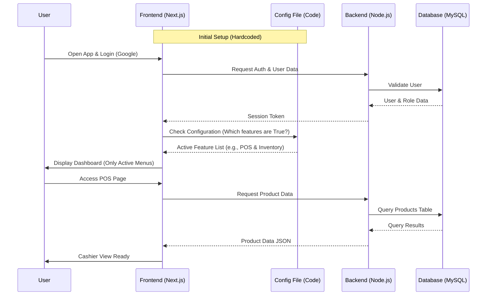
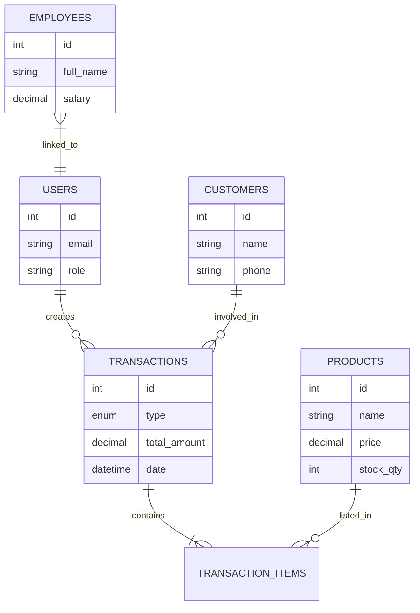

# PRD — Project Requirements Document

## 1. Overview
**Project Name:** Universal Business Management Dashboard Template

This application is an *All-in-One* web-based Dashboard template designed to help manage the operations of various types of businesses (SMEs). Its main goal is to provide a single complete codebase covering 5 core business pillars: Finance, HR, Inventory, CRM, and Point of Sale (POS).

The main problem it solves is the high cost and development time required to build a management system from scratch. With this template, developers or business owners can clone the project, then disable unneeded features simply by changing a configuration in the code (hardcoded `false`), making the application lightweight and tailored to specific needs without complex re-coding.

## 2. Requirements
The following are the main requirements for developing this system:

*   **High Modularity:** The system must be built so that each module (e.g., HR or POS) is independent. If a module is disabled via code, the UI and logic of that module must be completely removed from the user's view.
*   **Easy Customization:** Feature configuration is done through a single central configuration file in the code.
*   **Accessibility:** Easy login using a Google account (OAuth).
*   **Access Control:** A permission system that limits user access based on modules (e.g., Cashier can only access POS, Manager can access Finance).
*   **Modern Design:** Uses clean and responsive interface components.
*   **Self-Hosted Deployment:** Ready to be deployed on a private server (VPS).

## 3. Core Features
These features are the core of the template, which can later be enabled/disabled:

1.  **Authentication & Authorization**
    *   Login using Google (OAuth).
    *   User and Role management (Admin, Staff, Cashier, etc.).
    *   Per-module access rights configuration.

2.  **Point of Sale (POS) / Cashier**
    *   Fast sales transaction page.
    *   Receipt printing (digital/physical).
    *   Automatic total and change calculation.

3.  **Inventory / Stock Management**
    *   Product and category list.
    *   Stock-in (purchases) and stock-out recording.
    *   Low-stock alerts.

4.  **Accounting / Finance**
    *   Income and Expense recording.
    *   Simple Profit/Loss report.
    *   Daily/monthly transaction recap.

5.  **HRM / Personnel**
    *   Employee database.
    *   Position and base salary management.
    *   Simple attendance tracking.

6.  **CRM / Customers**
    *   Customer database (Name, Phone, Purchase History).
    *   Customer debt/receivable tracking (if any).

7.  **Global Config (Hardcoded)**
    *   A dedicated file (e.g., `features.config.js`) to set `true/false` on the modules above.

## 4. User Flow
This flow describes two perspectives: Developer (during setup) and End-User (during use).

**A. Setup Flow (Developer/IT Admin):**
1.  Clone the project repository.
2.  Open the feature configuration file.
3.  Set unneeded features to `false` (Example: a Service business does not need Stock, so `Inventory = false`).
4.  Deploy the application to the VPS.

**B. Daily User Flow (Example: Cashier):**
1.  Open the website dashboard.
2.  Login using a Google account.
3.  The system checks which modules are active and what the user's permissions are.
4.  The user enters the Dashboard (only enabled menus appear, e.g., POS).
5.  The user performs a sales transaction.
6.  The user logs out.

## 5. Architecture
This system uses a standard Client-Server architecture where the Frontend (Next.js) reads the feature configuration to render menus, and the Backend (Node.js) serves data from MySQL.

## 6. Database Schema
Relational database design to support all modules. All tables are still created during initialization, but may remain empty if a feature is disabled.

**Main Tables:**

1.  **users**: Stores application user data.
    *   `id` (INT): Primary Key.
    *   `email` (VARCHAR): Email for Google Auth.
    *   `role` (VARCHAR): Role (Admin, Staff, etc.).
    *   `permissions` (JSON): Module-specific access permissions.

2.  **products** (Inventory & POS Module): Merchandise data.
    *   `id` (INT): Primary Key.
    *   `name` (VARCHAR): Product name.
    *   `price` (DECIMAL): Selling price.
    *   `stock_qty` (INT): Current stock quantity.

3.  **transactions** (POS & Finance Module): Transaction header.
    *   `id` (INT): Primary Key.
    *   `type` (ENUM): 'INCOME' (Sales), 'EXPENSE' (Spending).
    *   `total_amount` (DECIMAL): Total value.
    *   `date` (DATETIME): Transaction time.
    *   `customer_id` (INT): Foreign Key to the customers table.

4.  **transaction_items** (POS Module): Item details within a transaction.
    *   `id` (INT): Primary Key.
    *   `transaction_id` (INT): Relation to the transaction.
    *   `product_id` (INT): Relation to the product.
    *   `qty` (INT): Quantity purchased.

5.  **customers** (CRM Module): Customer data.
    *   `id` (INT): Primary Key.
    *   `name` (VARCHAR): Customer name.
    *   `phone` (VARCHAR): Contact.

6.  **employees** (HRM Module): Detailed employee data.
    *   `id` (INT): Primary Key.
    *   `full_name` (VARCHAR): Full name.
    *   `position` (VARCHAR): Job position.
    *   `salary` (DECIMAL): Base salary.

## 7. Tech Stack
Technology recommendations based on user preferences and current industry standards:

*   **Frontend Framework:** **Next.js** (React) - For high performance and flexible rendering.
*   **UI Library:** **Shadcn/ui** - Modern interface components, easy to customize, and copy-paste friendly.
*   **Backend Runtime:** **Node.js** - Runs the server logic. Can use a lightweight framework such as **Express.js** or leverage Next.js built-in API Routes if a simpler (Monolith) architecture is preferred.
*   **Database:** **MySQL** - A stable relational database commonly used on VPS.
*   **ORM (Object-Relational Mapping):** **Prisma** or **Drizzle ORM** - To simplify communication between Node.js and MySQL and manage the database schema.
*   **Authentication:** **NextAuth.js (Auth.js)** - The standard solution for Google OAuth integration in Next.js.
*   **Deployment:** **VPS (Virtual Private Server)** - Using PM2 for Node.js process management and Nginx as the web server/reverse proxy.