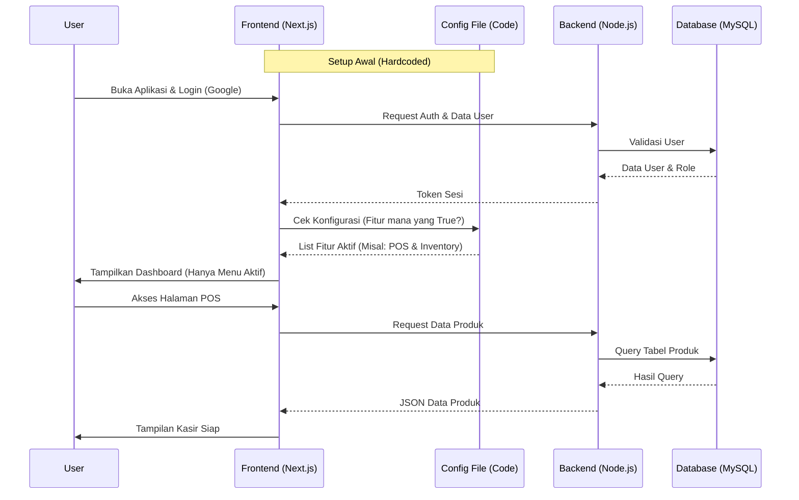
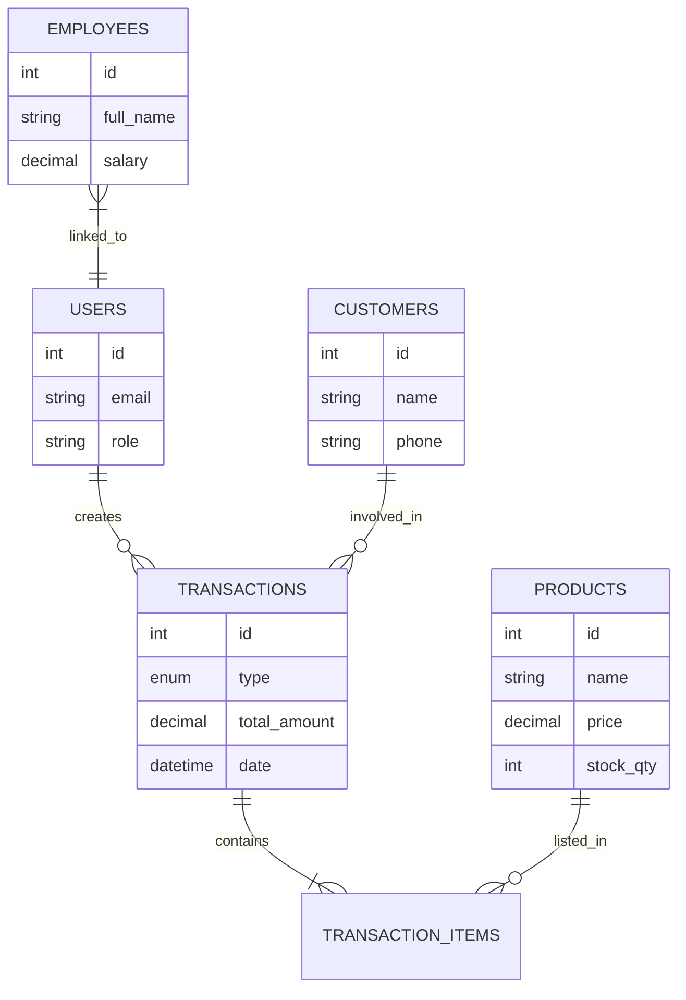

# PRD — Project Requirements Document

## 1. Overview
**Nama Proyek:** Universal Business Management Dashboard Template

Aplikasi ini adalah sebuah template *All-in-One* Dashboard berbasis web yang dirancang untuk membantu manajemen operasional berbagai jenis usaha (UMKM). Tujuan utamanya adalah menyediakan satu basis kode yang lengkap mencakup 5 pilar utama bisnis: Keuangan, HR, Inventaris, CRM, dan Kasir (POS).

Masalah utama yang ingin diselesaikan adalah biaya dan waktu pengembangan yang tinggi untuk membuat sistem manajemen dari nol. Dengan template ini, pengembang atau pemilik bisnis dapat melakukan *clone* proyek, lalu mematikan fitur yang tidak diperlukan hanya dengan mengubah konfigurasi di kode (hardcoded `false`), sehingga aplikasi menjadi ringan dan sesuai kebutuhan spesifik tanpa perlu coding ulang yang rumit.

## 2. Requirements
Berikut adalah persyaratan utama untuk pengembangan sistem ini:

*   **Modularitas Tinggi:** Sistem harus dibangun sedemikian rupa sehingga setiap modul (misal: HR atau POS) independen. Jika satu modul dinonaktifkan via kodingan, UI dan logika modul tersebut harus benar-benar hilang dari tampilan pengguna.
*   **Kemudahan Kustomisasi:** Konfigurasi fitur dilakukan melalui satu file konfigurasi pusat di dalam kode.
*   **Aksesibilitas:** Login yang mudah menggunakan akun Google (OAuth).
*   **Kontrol Akses:** Sistem izin (permission) yang membatasi akses pengguna berdasarkan modul (contoh: Kasir hanya bisa akses POS, Manajer bisa akses Keuangan).
*   **Desain Modern:** Menggunakan komponen antarmuka yang bersih dan responsif.
*   **Deployment Mandiri:** Siap untuk di-deploy di server pribadi (VPS).

## 3. Core Features
Fitur-fitur ini adalah inti dari template, yang nantinya bisa diaktifkan/dinonaktifkan:

1.  **Authentication & Authorization**
    *   Login menggunakan Google (OAuth).
    *   Manajemen User dan Role (Admin, Staff, Kasir, dll).
    *   Pengaturan hak akses per modul.

2.  **Point of Sale (POS) / Kasir**
    *   Halaman transaksi penjualan yang cepat.
    *   Pencetakan struk (digital/fisik).
    *   Kalkulasi total dan kembalian otomatis.

3.  **Inventaris / Manajemen Stok**
    *   Daftar produk dan kategori.
    *   Pencatatan stok masuk (pembelian) dan stok keluar.
    *   Peringatan stok menipis.

4.  **Akuntansi / Keuangan**
    *   Pencatatan Pemasukan dan Pengeluaran (Expense).
    *   Laporan Laba/Rugi sederhana.
    *   Rekapitulasi transaksi harian/bulanan.

5.  **HRM / Kepegawaian**
    *   Database karyawan.
    *   Manajemen posisi dan gaji dasar.
    *   Pencatatan absensi sederhana.

6.  **CRM / Pelanggan**
    *   Database pelanggan (Nama, No HP, Riwayat Belanja).
    *   Pencatatan hutang/piutang pelanggan (jika ada).

7.  **Global Config (Hardcoded)**
    *   File khusus (misal: `features.config.js`) untuk men-set `true/false` pada modul-modul di atas.

## 4. User Flow
Alur ini menggambarkan dua perspektif: Developer (saat setup) dan End-User (saat penggunaan).

**A. Alur Setup (Developer/Admin IT):**
1.  Clone repository proyek.
2.  Buka file konfigurasi fitur.
3.  Set fitur yang tidak dibutuhkan menjadi `false` (Contoh: Usaha Jasa tidak butuh Stok, maka `Inventory = false`).
4.  Deploy aplikasi ke VPS.

**B. Alur Pengguna Harian (Contoh: Kasir):**
1.  Buka website dashboard.
2.  Login menggunakan akun Google.
3.  Sistem mengecek modul apa yang aktif dan apa izin pengguna tersebut.
4.  User masuk ke Dashboard (Menu yang muncul hanya yang diaktifkan, misal: POS).
5.  User melakukan transaksi penjualan.
6.  User Logout.

## 5. Architecture
Sistem ini menggunakan arsitektur Client-Server standar di mana Frontend (Next.js) akan membaca konfigurasi fitur untuk merender menu, dan Backend (Node.js) melayani data dari MySQL.

## 6. Database Schema
Desain database relasional untuk mendukung seluruh modul. Tabel akan tetap dibuat semua saat inisialisasi, namun mungkin tidak terisi jika fiturnya dimatikan.

**Tabel Utama:**

1.  **users**: Menyimpan data pengguna aplikasi.
    *   `id` (INT): Primary Key.
    *   `email` (VARCHAR): Email untuk Google Auth.
    *   `role` (VARCHAR): Peran (Admin, Staff, dll).
    *   `permissions` (JSON): Izin akses modul spesifik.

2.  **products** (Modul Inventaris & POS): Data barang dagangan.
    *   `id` (INT): Primary Key.
    *   `name` (VARCHAR): Nama barang.
    *   `price` (DECIMAL): Harga jual.
    *   `stock_qty` (INT): Jumlah stok saat ini.

3.  **transactions** (Modul POS & Keuangan): Header transaksi.
    *   `id` (INT): Primary Key.
    *   `type` (ENUM): 'INCOME' (Penjualan), 'EXPENSE' (Pengeluaran).
    *   `total_amount` (DECIMAL): Total nilai.
    *   `date` (DATETIME): Waktu transaksi.
    *   `customer_id` (INT): Foreign Key ke tabel customers.

4.  **transaction_items** (Modul POS): Detail barang dalam transaksi.
    *   `id` (INT): Primary Key.
    *   `transaction_id` (INT): Relasi ke transaksi.
    *   `product_id` (INT): Relasi ke produk.
    *   `qty` (INT): Jumlah barang dibeli.

5.  **customers** (Modul CRM): Data pelanggan.
    *   `id` (INT): Primary Key.
    *   `name` (VARCHAR): Nama pelanggan.
    *   `phone` (VARCHAR): Kontak.

6.  **employees** (Modul HRM): Data pegawai detail.
    *   `id` (INT): Primary Key.
    *   `full_name` (VARCHAR): Nama lengkap.
    *   `position` (VARCHAR): Jabatan.
    *   `salary` (DECIMAL): Gaji pokok.

## 7. Tech Stack
Rekomendasi teknologi berdasarkan preferensi user dan standar industri saat ini:

*   **Frontend Framework:** **Next.js** (React) - Untuk performa tinggi dan rendering yang fleksibel.
*   **UI Library:** **Shadcn/ui** - Komponen antarmuka yang modern, mudah dikustomisasi, dan *copy-paste friendly*.
*   **Backend Runtime:** **Node.js** - Menjalankan logika server. Bisa menggunakan framework ringan seperti **Express.js** atau memanfaatkan API Routes bawaan Next.js jika ingin arsitektur yang lebih simpel (Monolith).
*   **Database:** **MySQL** - Database relasional yang stabil dan umum digunakan di VPS.
*   **ORM (Object-Relational Mapping):** **Prisma** atau **Drizzle ORM** - Untuk mempermudah komunikasi antara Node.js dan MySQL serta manajemen skema database.
*   **Authentication:** **NextAuth.js (Auth.js)** - Solusi standar untuk integrasi Google OAuth di Next.js.
*   **Deployment:** **VPS (Virtual Private Server)** - Menggunakan PM2 untuk manajemen proses Node.js dan Nginx sebagai web server/reverse proxy.